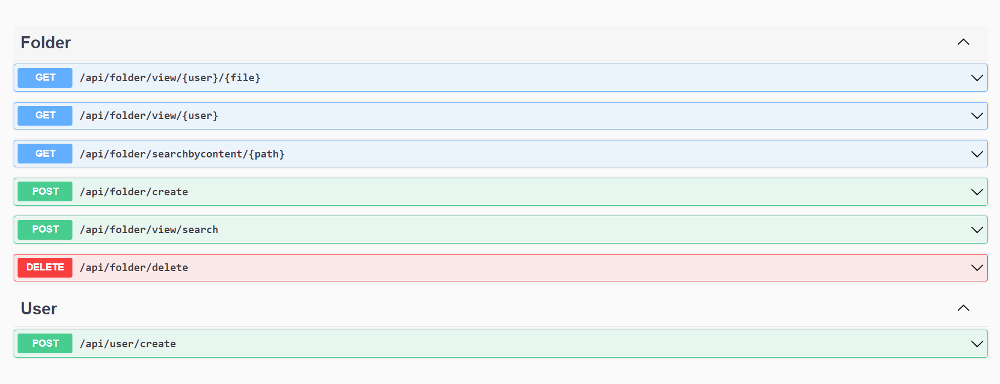
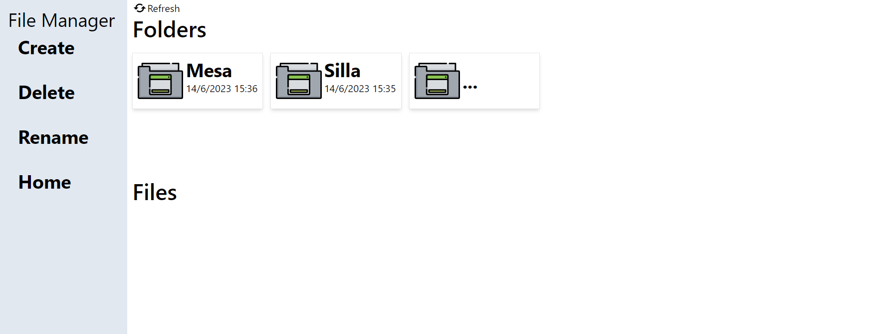

# File Explorer

<!-- PROJECT LOGO -->
 

  

  <h3 align="center">File Explorer</h3>

  

    Crear un File Explorer como un projecto personal
     
    <a href="#aspnet-core">Imagen BankEnd</a>
    ·
    <a href="#angular">Imagen FronEnd</a>
    ·
  

### Tabla de Contenidos

<ol>
  <li>
    <a href="#acerca-del-proyecto">Acerca del Proyecto</a>
    <ul>
      <li><a href="#tecnologías-utilizadas">Tecnologías Utilizadas</a></li>
    </ul>
  </li>
  <li>
    <a href="#imágenes">Imágenes</a>
    <ul>
      <li><a href="#aspnet-core">ASP.NET Core</a></li>
      <li><a href="#angular">Angular</a></li>
    </ul>
  </li>
</ol>

### Tecnologias usadas

#### BackEnd
* ASP.NET Core 7.0
* Entity Framework Core
* SQL Server
* Swagger
* FluentValidation 
* Dotnet Ef

### ASP.NET Core

#### FrontEnd 
* Angular

### Angular
